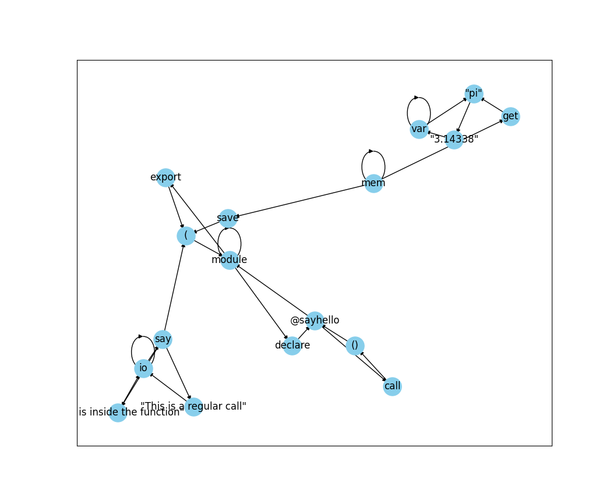

## 🚀 Overview
GRAP is a 🎉 simple, yet powerful programming language designed to make programming more intuitive and accessible. It is built using C and Python, and it allows you to write programs in a graph-like structure, making it easier to visualize the flow of data and control.

## 🌟 Key Features
- **📊 Graph Structure**: Write your programs in a graph-like structure, making it easier to visualize the flow of data and control.
- **💾 Memory Management**: Graph provides a simple memory structure for storing and retrieving variables.
- **📢 IO Module**: The language includes built-in support for basic input and output operations.
- **🎬 Interpreted Language**: Graph is an interpreted language, which means you can run your programs directly without needing to compile them first.

## 📜 Example Code
Here's a simple example of a Graph program:

```grap

mem | save | ( var | "pi"    | "3.14"  )
mem | save | ( var | "greet" | "hello" )
io  | say  | "PI is equal to:"
io  | say  | ( mem | get | "pi" )
io  | say  | "A greeting is:"
io  | say  | ( mem | get | "greet" )
io  | say  | "That is it for today! Goodbye!"
```

This program saves the values "3.14" and "hello" to the variables "pi" and "greet" respectively. It then prints out the values of these variables.

## 🚀 Getting Started
To get started with Graph, you'll need to clone the repository and build the interpreter. Detailed instructions for this process can be found in the `INSTALL.md` file.

## 📚 Documentation
For more detailed information about the language, including its syntax and built-in functions, please refer to the `DOCS.md` file.

### More Examples

```grap
module | declare | @sayhello
module | export | (
    mem | save | (
        var | "pi" | "3.14338"
        )
    )
module | export | (
        io | say | "This is inside the function"
    )
module | export | (
    io | say | (
        mem | get | "pi"
        )
    )

io | say | "This is a regular call"

@sayhello | call | ()
```

Would look something like this in the interpreter:


And would output this as a result:
> This is a regular call 
> 
> This is inside the function
> 
> 3.14338


## 🤝 Contributing
We welcome contributions from the community. If you're interested in contributing, please see the `CONTRIBUTING.md` file for guidelines.

## 📄 License
Graph is licensed under the MIT license. For more information, see the `LICENSE` file.


### But what is GRAP?
+ GRAP: GRAP Representation and Processing
    + GRAP: GRAP Representation and Processing
        + GRAP: GRAP Representation and Processing
            + ...
